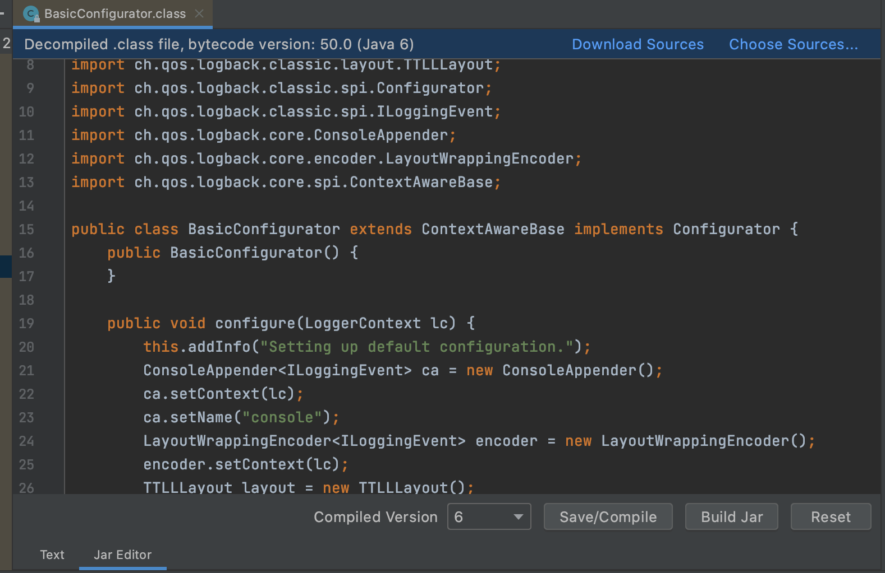

JarEditor is an IDEA plugin that can modify the files in JAR directly without decompression, including class and resource files.

Open the file in JAR , you can **Modify it directly**->**Save/Compile**->**Build Jar** to modify a jar package.
