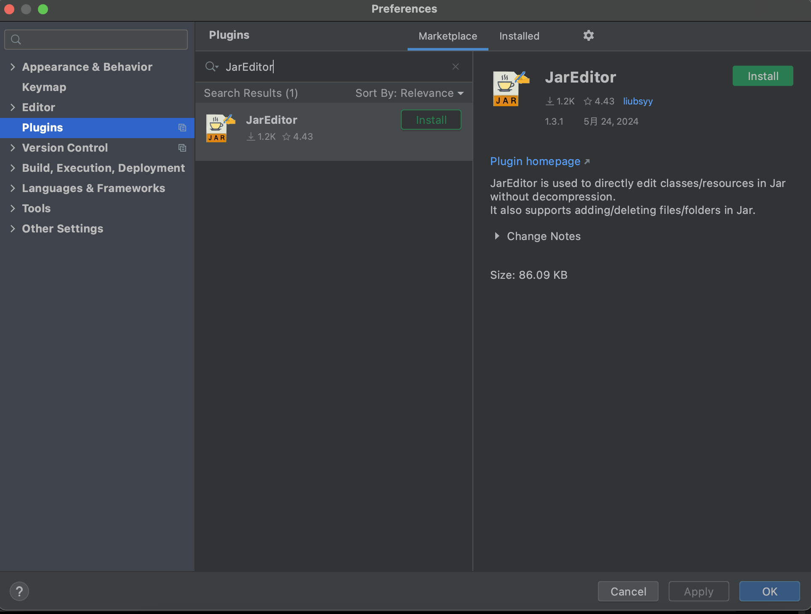
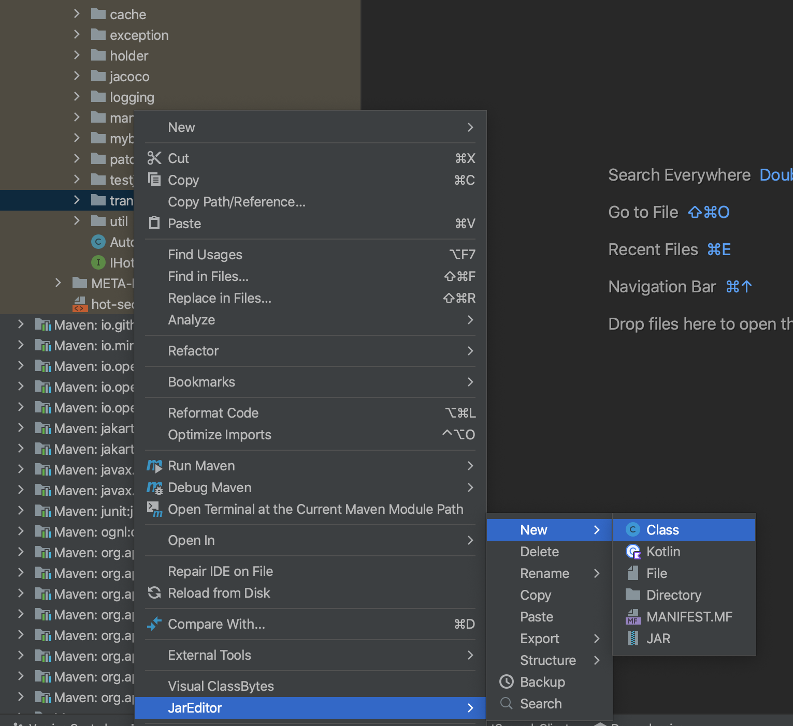
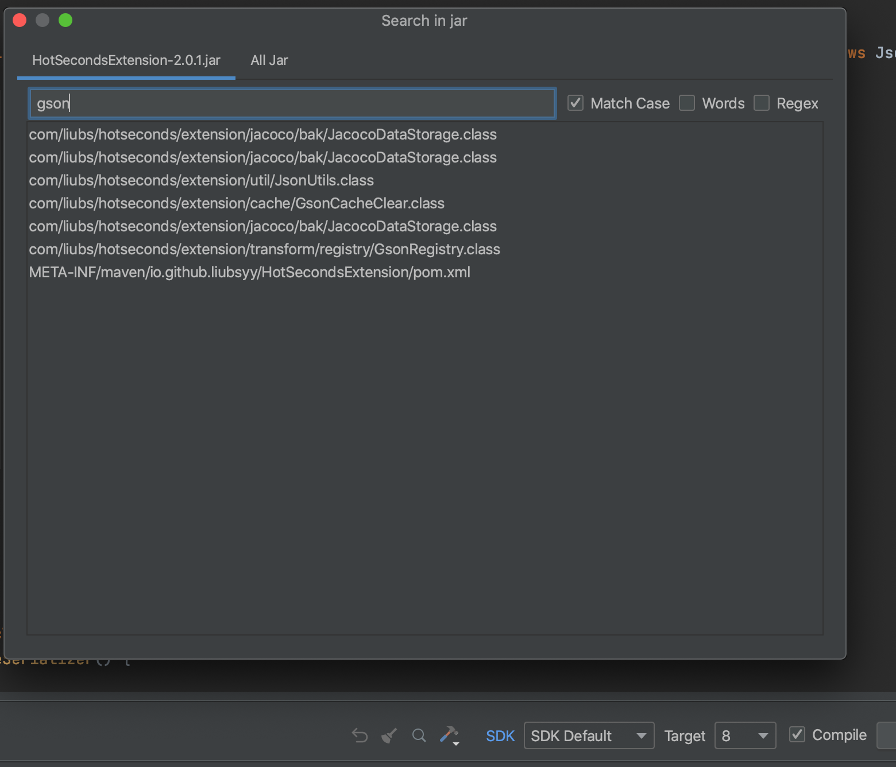

  

<h2 align="center">JarEditor <em>liubsyy</em></h2>

<h4 align="center"><strong>English</strong> | <a href="./README_CN.md">简体中文</a></h4>

IDEA plugin for modifying files in jar directly without decompression, including class and resource files.

**Plugin marketplace** : [https://plugins.jetbrains.com/plugin/24397-jareditor](https://plugins.jetbrains.com/plugin/24397-jareditor)

## Features
- Edit class/resource files in jar directly without decompression
- Add/Delete/Rename file/directory in jar
- Paste file/directory from clipboard
- Copy file/directory to clipboard
- Support springboot fatjar
- Support kotlin
- Supports class jar importing code from source jar, and class/source jar jumping between each other
- Search the contents of the jar package(class jar is searched based on decompilation)

## Quick start

### 1. Install plugin from marketplace
First install the plugin JarEditor from marketplace, IDEA at least version **2020.3**

### 2. Edit and Build Jar
After installation , you can see a tab page to switch to Jar Editor in the .class decompiled file.

`External jars: File->Project Structure->Libraries->Add Library , then you can see the decompiled jar.`

After modification, click **Save(Compile)** to compile and save the currently modified java content. 

Finally click **Build Jar** to write the compiled and saved class file into the Jar package.

Modifying the resource files in the jar package is also supported.

### 3. Other operations of JarEditor
In the project view of the jar package, right-click to see **JarEditor->New/Delete** and other operations, where you can add/delete/rename/copy/paste files.

Click the **Search** icon to search the contents of the jar package. If it is a class jar, it will be searched based on the decompiled content.

## Some mechanisms
- The JDK that the compilation depends on is the JDK of your SDK list. You can choose SDK and target version of the compiled class.
- The classpath you depend on when compiling java is the dependency of the project. If the dependency package cannot be found, you can add the dependency.
- Save(Compile) will save the modified files to the subdirectory **jar_edit_out** of the directory where the jar package is located. Build Jar will incrementally write the modified files to jar, and finally delete this directory.

### SDK Default Versions

When compiling and selecting **SDK Default**, the corresponding JDK version is as follows

IDEA|JDK
---|---
IDEA 2020.3 - IDEA 2022.1 |JDK 11
IDEA 2022.2 - IDEA 2024.1 |JDK 17
IDEA 2024.2 and later |JDK 21
