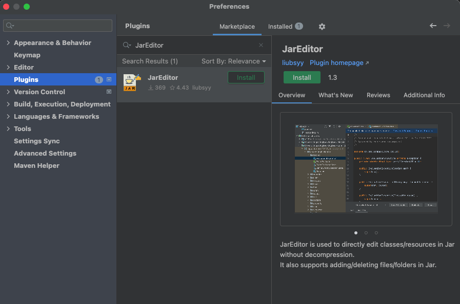
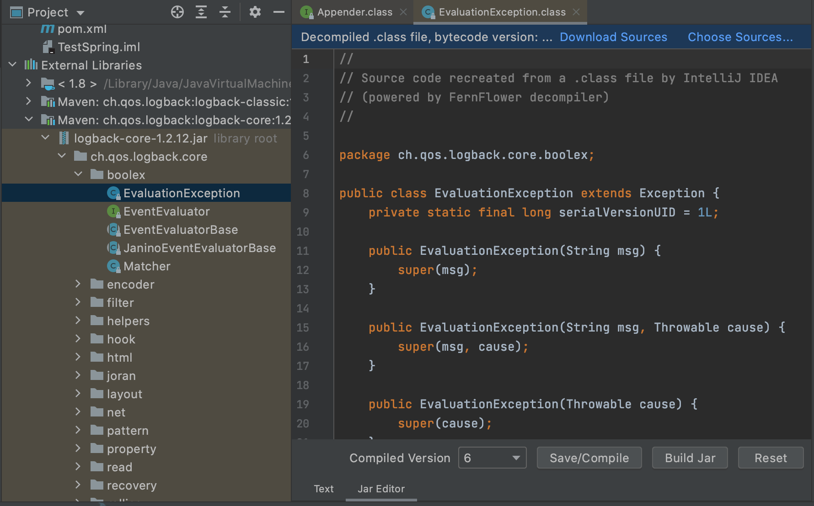
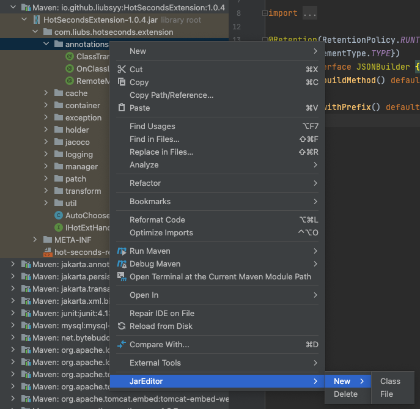

  

<h2 align="center"/>JarEditor <em>liubsyy</em></h2>

<!--<h4 align="center"><strong>English</strong> | <a href="./README_CN.md">简体中文</a></h4>-->

IDEA plugin for modifying files in jar directly without decompression, including class and resource files.

**Plugin marketplace** : [https://plugins.jetbrains.com/plugin/24397-jareditor](https://plugins.jetbrains.com/plugin/24397-jareditor)

## Features
- Edit class/resource files in jar directly without decompression
- Add new file/dictionary in jar
- Delete file/dictionary in jar
- Support springboot fatjar

## Quick start

### 1. Insatall plugin from marketplace
First install the plugin JarEditor from marketplace, IDEA at least version **2020.3**

### 2. Edit and Save Jar
After installation , you can see a tab page to switch to Jar Editor in the .class decompiled file.

`External jars: File->Project Structure->Libraries and then decompile the jar.`

Modify your source code, click **Save/Compile** to compile and save the currently modified java content. 

Finally click **Build Jar** to write the compiled and saved class file into the Jar package.

Modifying the resource files in the jar package is also supported.

### 3. Other operations of JarEditor
In the project view of the jar package, right-click to see JarEditor->Add/Delete and other operations, where you can add and delete files.

