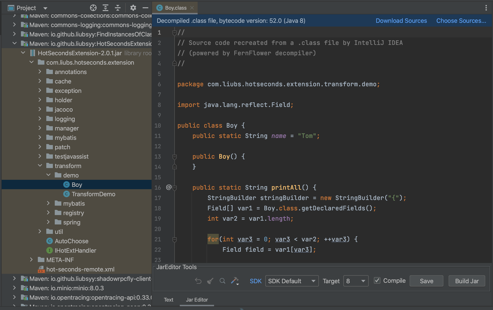
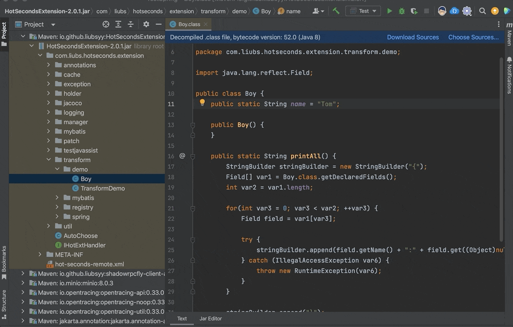
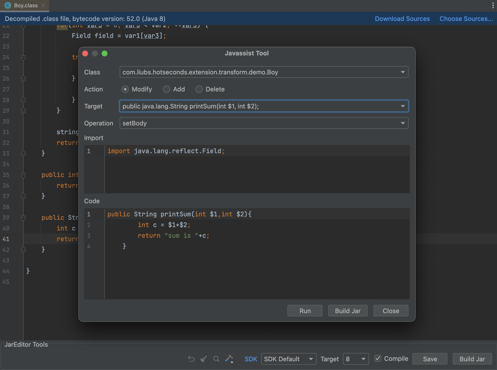
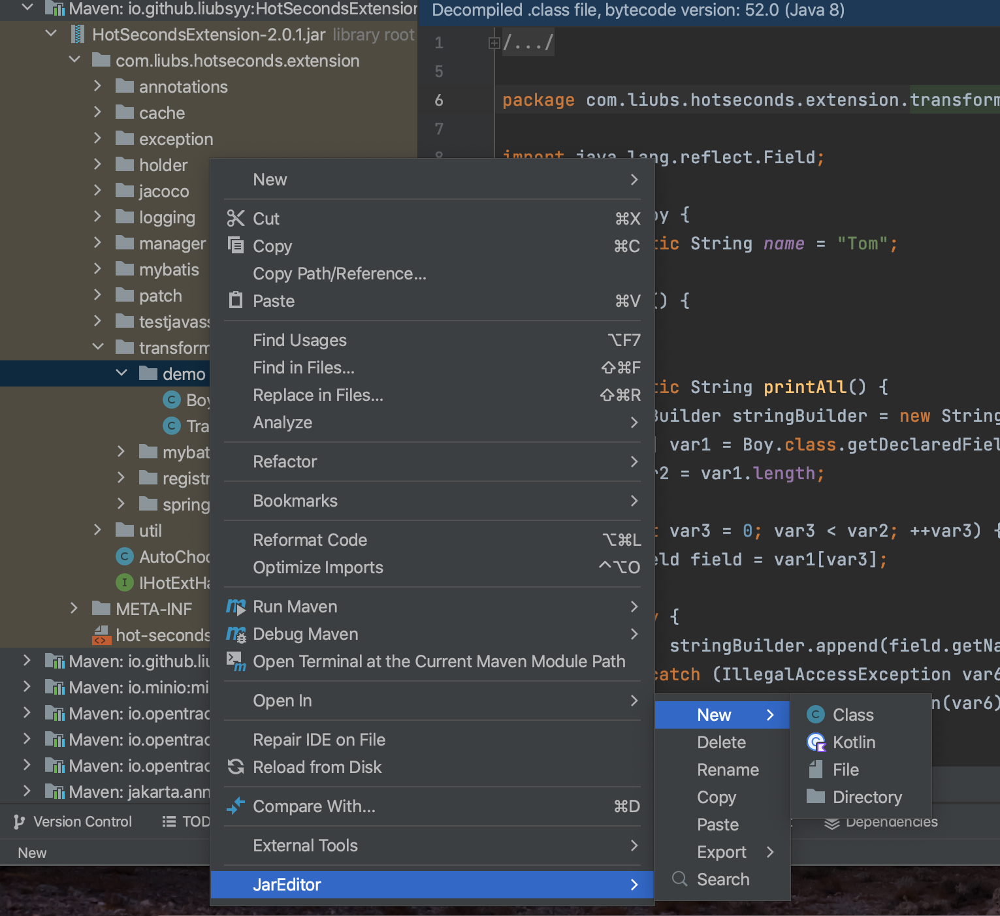

  

<h2 align="center">JarEditor <em>liubsyy</em></h2>

<h4 align="center"><strong>English</strong> | <a href="./README_CN.md">简体中文</a></h4>

IDEA plugin for modifying files in jar directly without decompression, including class and resource files.

**Plugin marketplace** : [https://plugins.jetbrains.com/plugin/24397-jareditor](https://plugins.jetbrains.com/plugin/24397-jareditor)

## Features
- Edit class/resource file in jar directly without decompression
- Add/Delete/Rename file/directory in jar
- Search the contents of the jar package
- Copy/Paste file/directory to/from clipboard
- Support SpringBoot jar/nested jar/war/ear/zip/aar
- Support kotlin
- Export source jar
- Support class bytes tool : Javassist/VisualClassBytes
- Decompilers : Fernflower/CFR/Procyon/Jadx

## Quick start

### 1. Install plugin from marketplace
First install the plugin JarEditor from marketplace, IDEA at least version **2020.3**

### 2. Edit and Build Jar
After installation , you can see a tab page to switch to Jar Editor in the .class decompiled file.

> **External jar** : File->Project Structure->Libraries->Add Library , then you can see the decompiled jar. 
> **Nested jar** : Right click on nested jar->JarEditor->Structure->Expand Nested Jar

After modification, click **Save(Compile)** to compile and save the currently modified java content. 

Finally click **Build Jar** to write the compiled and saved class file into the Jar package.

Modifying the resource files in the jar package is also supported.

Here is an example:

### 3. Class bytes tool
For obfuscated jars, the decompilation result is not satisfactory. In this case, you can use tools to directly modify the bytecode.
Click the **Class bytes tool** icon to select the tool

- **Javassist** : Field/method/constructor/static code can be modified/added/deleted (include inner class)

- [**Visual ClassBytes**](https://github.com/Liubsyy/VisualClassBytes) : Class bytecode editor,based on ASM and BCEL

### 4. Other operations of JarEditor
In the project view of the jar package, right-click to see **JarEditor->New/Delete** and other operations, where you can add/delete/rename/copy/paste/export/backup files.

Click the **Search** icon to search the contents of the jar package. If it is a class jar, it will be searched based on the decompiled content.

## Some mechanisms
- The JDK that the compilation depends on is the JDK of your SDK list. You can choose SDK and target version of the compiled class.
- The classpath you depend on when compiling java is the project's Libraries dependency. If the dependency package cannot be found, you can add Libraries(File->Project Structure->Libraries).
- Save(Compile) will save the modified files to the subdirectory **jar_edit_out** of the directory where the jar package is located. Build Jar will incrementally write the modified files to jar, and finally delete this directory.

### SDK Default Versions

When compiling and selecting **SDK Default**, the runtime JDK (JBR) integrated by Jetbrains is used. If SDK Default is not selected, the JDK installed by the specific user will be used.

IDEA|JDK
---|---
IDEA 2020.3 - IDEA 2022.1 |JBR JDK11
IDEA 2022.2 - IDEA 2024.1 |JBR JDK17
IDEA 2024.2 and later |JBR JDK21
