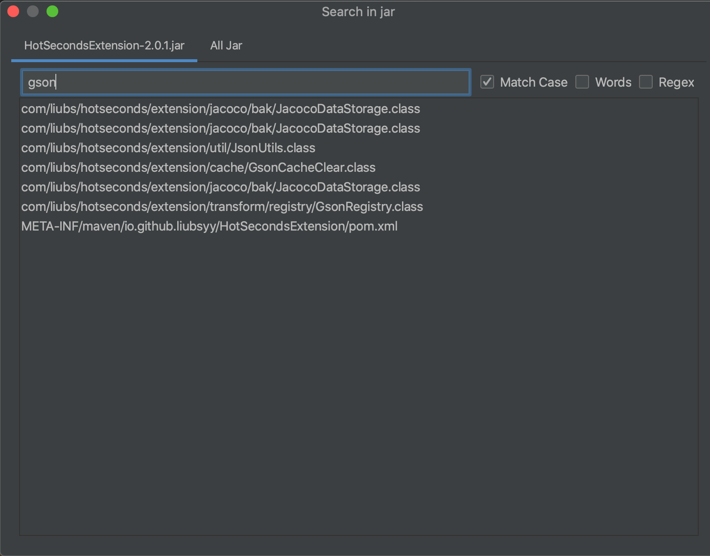

  

<h2 align="center">JarEditor <em>liubsyy</em></h2>

<h4 align="center"><a href="./README.md">English</a> | <strong>简体中文</strong></h4>

可直接修改jar包内文件的IDEA插件，无需解压

**Plugin marketplace** : [https://plugins.jetbrains.com/plugin/24397-jareditor](https://plugins.jetbrains.com/plugin/24397-jareditor)

## 功能
- 直接编辑jar包内class/resource文件，无需解压
- 添加/删除/重命名jar包内文件/文件夹
- 搜索jar包的内容
- jar内复制/粘贴文件到外部剪切板
- 支持SpringBoot jar
- 支持kotlin
- 可导出source jar
- 支持class字节码修改工具 : javassist

## 快速开始

### 1. 从插件市场安装插件
首先从市场安装插件 JarEditor，IDEA版本 >= **2020.3**

### 2. 编辑并构建 Jar
安装完成后，在.class反编译文件中可以看到切换到Jar Editor的tab页。

>外部jar：File->Project Structure->Libraries->Add Library，然后就可以看到反编译的jar了。

修改完成后，点击**Save（Compile）**，编译并保存当前修改的java内容。

最后点击**Build Jar**，将编译保存的类文件写入Jar包中。

修改jar包中的资源文件也是支持的。

### 3. 其他操作
在jar包的项目视图中，右键可以看到**JarEditor->New/Delete**等操作，可以在jar内添加/删除/重命名/复制/粘贴文件。

点击 **Search** 图标，可以搜索jar包的内容，如果是class jar将根据反编译的内容进行搜索

## 一些机制
- 编译依赖的JDK是你的SDK列表中的JDK。您可以选择SDK和编译类的目标版本。
- 编译java时所依赖的classpath就是项目的Libraries依赖。如果找不到依赖包，可以添加依赖。
- Save(Compile)会将修改后的文件保存到jar包所在目录的子目录**jar_edit_out**中，Build Jar会将修改的文件增量写入jar中，最后删除这个临时目录。

### SDK Default对应JDK版本

编译选择 **SDK Default** 时，对应的JDK版本如下

IDEA|JDK
---|---
IDEA 2020.3 - IDEA 2022.1 |JDK 11
IDEA 2022.2 - IDEA 2024.1 |JDK 17
IDEA 2024.2 及更高版本 |JDK 21
